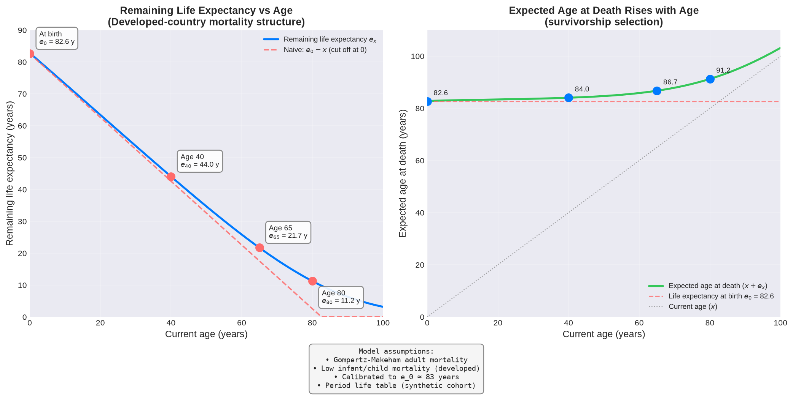

# Age vs Life Expectancy

This folder contains some random calculations and notes about remaining life expectancy by age.

## 1. Age vs Remaining Life Expectancy

[Age vs Remaining Life Expectancy - Jupyter Notebook](age_life_expectancy.ipynb)

This Jupyter Notebook builds a period life table from a developed-country mortality schedule (low early-age death rates, Gompertz rise at older ages) and plots remaining life expectancy against current age — including the expected age at death, which rises as you get older.
