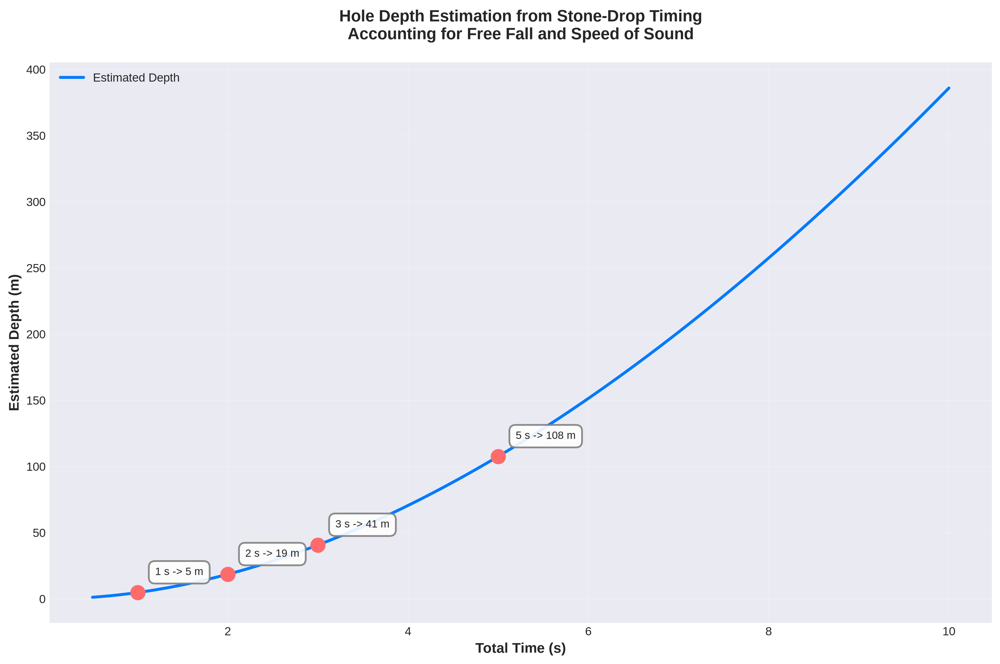

# Hole Depth

This folder contains random calculations about estimating hole depth by timing a dropped stone.

## 1. Hole Depth Estimation

[Hole Depth Estimation - Jupyter Notebook](hole_depth_estimation.ipynb)

This Jupyter Notebook estimates the depth of a hole from the total time between dropping a stone and hearing it hit the bottom, accounting for both free fall and the speed of sound.
