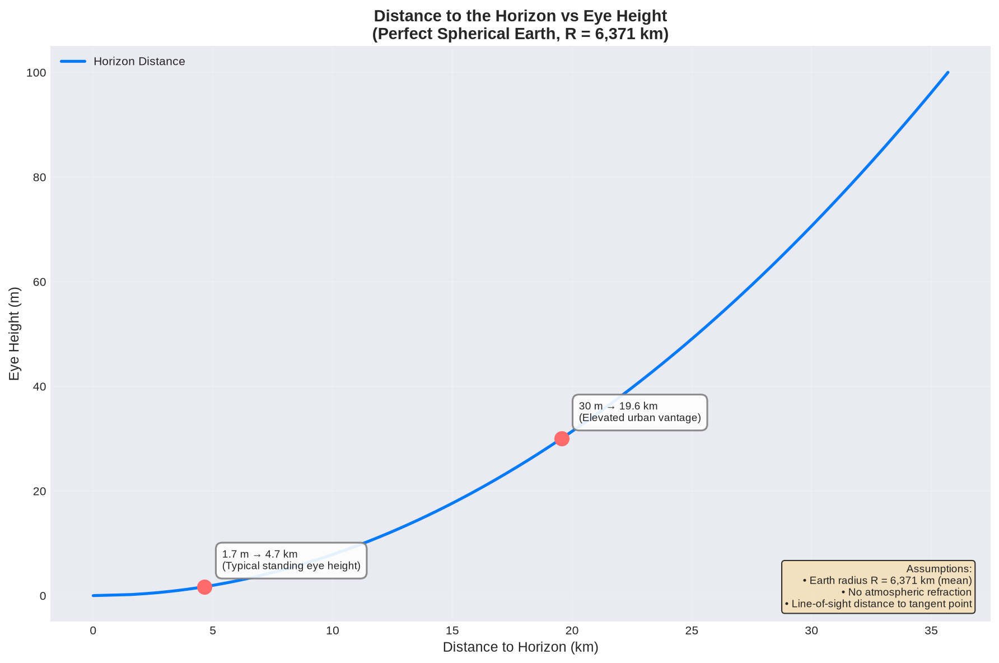

# How Far Is the Horizon

This folder contains some random calculations and notes about the distance to the horizon.

## 1. How Far Is the Horizon

[How Far Is the Horizon - Jupyter Notebook](horizon_distance.ipynb)

This Jupyter Notebook calculates and visualizes the line-of-sight distance to the horizon as a function of eye height above the Earth's surface, assuming Earth is a perfect sphere.
