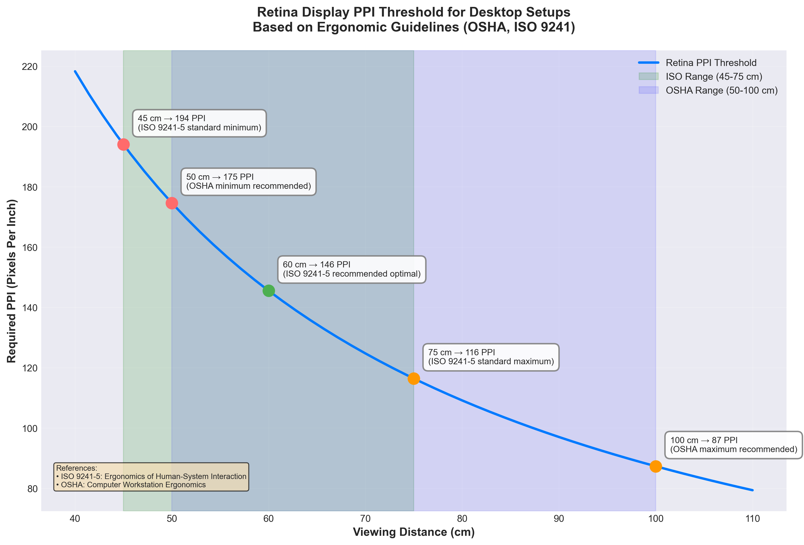

# Retina Display

This folder contains some random calculations and notes about the Retina Display.

## 1. Retina Display PPI Threshold

[Retina Display PPI Threshold - Jupyter Notebook](retina_ppi_threshold.ipynb)

This Jupyter Notebook calculates and visualizes the PPI (Pixels Per Inch) threshold required for a "Retina" display at various viewing distances, with a focus on desktop workstation ergonomic guidelines.
